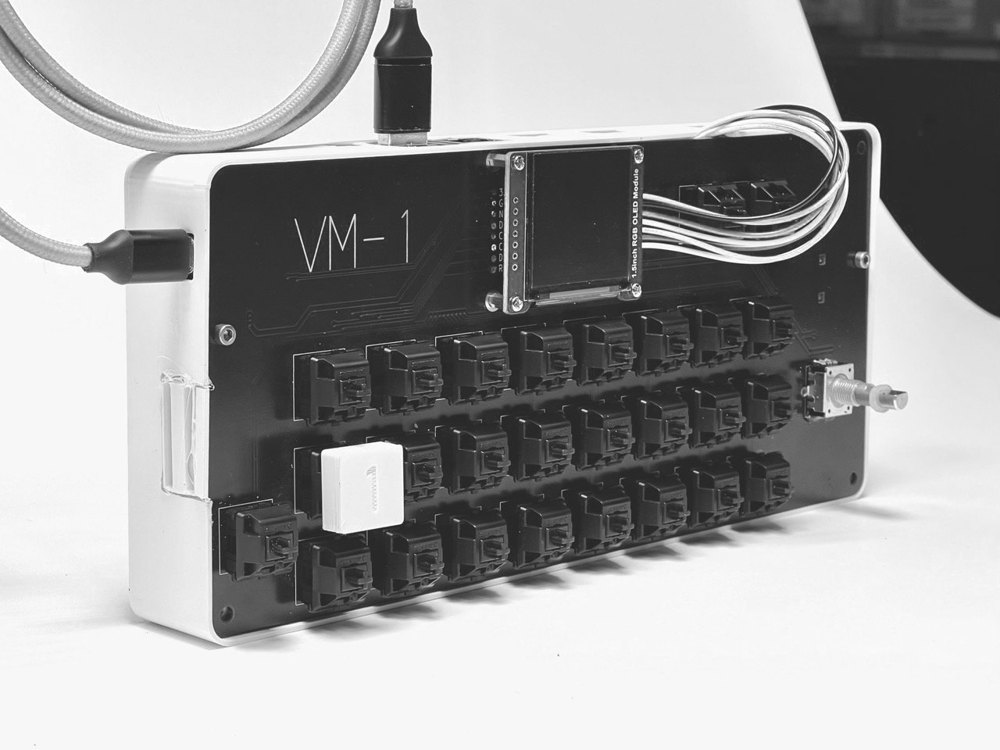
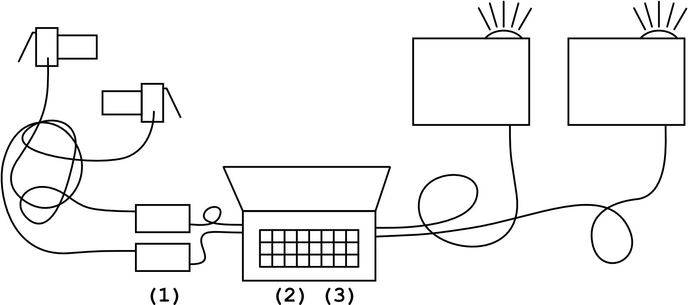
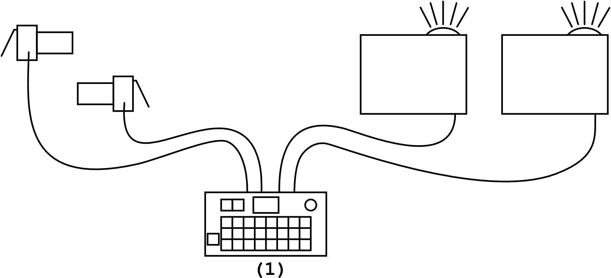
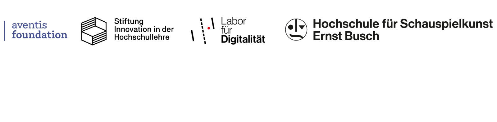

---
hide:
    - footer
---

# introducing: the VM-1

an <mark class="b">open-source</mark>, <mark class="b">low cost</mark>, <mark class="b">full-hd</mark> <mark class="b">video mixer</mark> and <mark class="b">video sampler</mark> for <mark class="b">creatives</mark>.

...all based on the raspberry pi 5.

the VM-1 [faʊ̯ ɛm aɪ̯ns] (or german: *Video Mischer Eins*) is currently in prototyping phase and has the following goals:

* make live visuals easy, playful and accessible.
* be open source and relatively low-cost.
* easy to be build.

## what is it exactly?

we like to think of it as a <mark><i>visual instrument</i></mark>. just like a musical instrument - but for visuals. you can <mark>play</mark> and <mark>blend</mark> pre-recorded <mark>videos</mark> with other videos or <mark>live-cameras</mark>, adding effects and your unique style.

we want to enable artists with no or little technical skills to create high quality film content on stage. using the VM-1 will raise the level of their live video shows by focusing on playful creativity and visual aesthetics. VM-1 is made for, but not limited to, low budget live events.

#### watch a quick demo

-> to do: video of the basic usage <-

## who on planet earth needs this?

the VM-1 is targeting <mark>creatives</mark> who do <mark>live shows</mark>, <mark>performances</mark>, <mark>theatre</mark>, <mark>choreography</mark> or <mark>VJ-sets</mark> and whoever wants to explore their <mark>own visual style</mark> with video, visual samples or motion graphics.

## I have seen video on stage before. what's so special about the VM-1?

* the VM-1 is super <mark>easy and fun to use</mark>. 
* it's <mark>cheaper</mark> than traditional setups. 
* it's <mark>open source</mark>. 
* there is afaik <mark>no comparable product</mark> on the market.

let's have a look at this in detail:

##### a traditional setup

a traditional setup with projectors and live cameras needs a laptop, hdmi-capture-devices and a software (like vvvv, isadora, resolume, touch-designer, tooll3, you-name-it).

this works perfectly with the downside that it's rather expensive and a bit more complicated to learn it's usage. 

<figure>

<figcaption>
a traditional setup with two cameras and two projectors. (1) hdmi capture devices, (2) laptop, (3) software. 
we will not address how the cables are laid here.
</figcaption>
</figure>

##### vm-1 setup

the VM-1 has it all-in-one. plug in almost any cameras and use it for your upcoming live show with two (big) projectors, mixing it with your pre-produced videos - without any laptop or other gear. simply press a button and the selected video or live-input will be played.

<figure>

<figcaption>
VM-1 with two cameras and two projectors. (1) VM-1. 
out of a sudden, even the cables are laid nicely.
</figcaption>
</figure>

to be honest, we're still amazed that this is even possible with a tiny computer like the raspberry pi.

## I <s>want</s> need it. where do i get it?

<!-- what we learned from the music making industry is, that - although there are tons of daws and vsts to make music - many musicians like the feeling of having an instrument that's *not their laptop*. you get creative within the limitations of this instrument and get inspired by the sound, haptics and user experience their creators put on it. -->

<!-- the VM-1 is a project from the digital lab at the "ernst busch" academy of dramatic arts. 
it is made with ♥︎ in hamburg and berlin by nils zweiling and julian jungel.

the VM-1 is funded by [aventis foundation](https://www.aventis-foundation.org/foerderung/kultur/digitale-experimente/) in 2024. 
the digital lab is funded by [stiftung innovation in der hochschullehre](https://stiftung-hochschullehre.de) from 2021-2025
 -->
